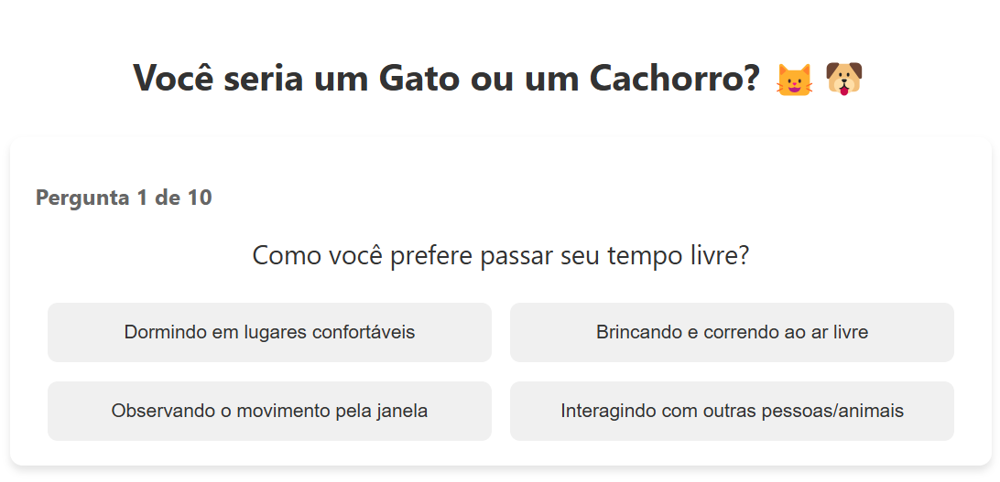

# 🎯 Clone do BuzzFeed - Decola Tech Avanade 2025

## 📝 Descrição
Projeto desenvolvido durante o bootcamp Decola Tech Avanade 2025, onde criamos um clone do BuzzFeed utilizando Angular. O quiz "Você seria um Gato ou um Cachorro?" demonstra o uso de componentes, data binding, e design responsivo em Angular.

## 🚀 Tecnologias Utilizadas
- Angular 17
- TypeScript
- HTML5
- CSS3
- Git

## ✨ Funcionalidades
- Quiz interativo com 10 perguntas
- 4 opções de resposta para cada pergunta
- Sistema de pontuação
- Resultado personalizado (Gato ou Cachorro)
- Design responsivo para todos os dispositivos
- Animações suaves
- Interface moderna e amigável

## 🎨 Preview


## 🔧 Instalação
```bash
# Clone este repositório    
git clone https://github.com/pnascimentodev/angular-buzzfeed-quizz.git

# Acesse a pasta do projeto
cd angular-buzzfeed-quizz

# Instale as dependências
npm install

# Execute a aplicação
ng serve

# O servidor iniciará na porta:4200 - acesse http://localhost:4200
```

## 📚 Estrutura do Projeto
```
src/
├── app/
│   ├── quiz/
│   │   ├── quiz.component.ts
│   │   ├── quiz.component.html
│   │   └── quiz.component.css
│   ├── app.component.ts
│   └── ...
├── assets/
│   ├── gato.jpg
│   └── cachorro.jpg
└── ...
```

## 🤝 Contribuindo
1. Fork o projeto
2. Crie sua Feature Branch (`git checkout -b feature/AmazingFeature`)
3. Commit suas mudanças (`git commit -m 'Add some AmazingFeature'`)
4. Push para a Branch (`git push origin feature/AmazingFeature`)
5. Abra um Pull Request

## 📝 Licença
Este projeto está sob a licença MIT. Veja o arquivo [LICENSE](LICENSE) para mais detalhes.

## ✍️ Autor
Priscila Nascimento

## 🎁 Agradecimentos
- DIO
- Avanade
- Instrutores do bootcamp
- Comunidade Angular